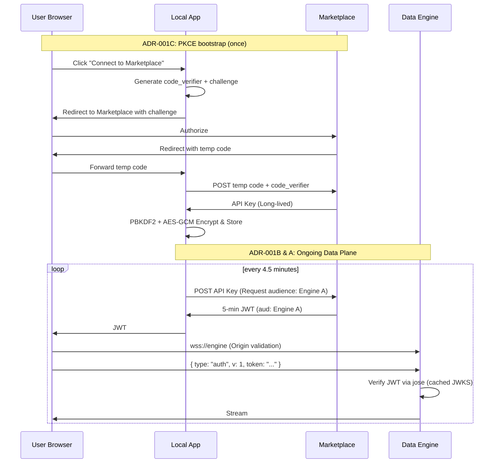

# ADR-001: Decentralized Plugin Authentication & SSRF Mitigation

## Status
Proposed *(Pending Review)*

## Date
2026-05-14

## Related
- **Dependencies:** `docs/ARCHITECTURE.md` (Agnostic Client principle), `prisma/schema.prisma` (existing Local App Postgres integration).

---

## Context

The WorldWideView ecosystem faces four interlocking security and scalability problems:

1. **The SSRF Liability:** The Local App uses generic proxy routes (`/api/camera/proxy`) to bypass browser CORS restrictions. These lack robust SSRF hardening (no DNS rebinding defense, no private IP blocking), exposing the host LAN.
2. **The CORS Barrier:** Browser-enforced Cross-Origin Resource Sharing (CORS) prevents the agnostic frontend from connecting directly to independent Data Engines via standard HTTP.
3. **The Centralization Bottleneck:** If every Data Engine queries the Marketplace database to verify a user's subscription on every frame, the Marketplace becomes a catastrophic bottleneck.
4. **The Credential Interception Threat:** Passing credentials via simple URL redirects during setup exposes them to browser history theft and MITM attacks.

To resolve these, we are adopting an umbrella "Token Exchange" architecture, broken down into four specific decisions.

---

## Decisions

### ADR-001A: Direct WebSocket Data Plane
We mandate that heavy data streams utilize WebSockets (`wss://`). Browsers do not apply CORS preflight to WebSockets, allowing direct connections.
*   **Security Constraint:** Because CORS is bypassed, Data Engines MUST explicitly validate the `Origin`, `Host`, TLS state, and expected tenant/plugin metadata upon connection.

### ADR-001B: Marketplace-Issued JWT Tickets
To enforce monetization without centralized database queries, we implement a stateless Token Exchange via Asymmetric Cryptography (Ed25519).
*   **The JWT Contract:** The token MUST contain the following claims:
    *   `iss`: `https://marketplace.worldwideview.dev`
    *   `sub`: The user's unique ID.
    *   `aud`: **Crucial.** The specific Data Engine or plugin ID. Tokens MUST be audience-bound to prevent a valid token for Engine A being replayed against Engine B.
    *   `exp`: Expiration (exactly 5 minutes from issuance).
    *   `iat`: Issued at.
    *   `jti`: Unique token identifier.
    *   `tier`: Subscription level (e.g., "pro").
    *   `scope`: Specific entitlements.

### ADR-001C: PKCE Bootstrap (The API Key)
The Local App acts as the credential holder. It uses the OAuth 2.0 Authorization Code flow with PKCE to securely acquire a **long-lived refresh credential** (The API Key).
*   **API Key Lifetime:** The API Key does not expire automatically but is bound to the specific device/installation. It rotates manually via the Marketplace UI or automatically upon suspicion of compromise. 

### ADR-001D: SSRF Proxy Hardening
For legacy plugins (e.g., Webcams) that *cannot* use WebSockets, the local proxy must be hardened.
*   **Constraints:** We will remove generic proxying where possible. Where proxying remains, we enforce:
    1. Exact HTTPS origin allowlists.
    2. Blocking of private / link-local / loopback IPs *after* DNS resolution.
    3. Re-resolving or pinning DNS to defend against DNS rebinding.
    4. Rejecting redirects to non-allowlisted hosts.
    5. Strict payload size and time limits.

---

## Threat Model & Non-Goals

**In Scope:** 
* Defending against external attackers on the user's LAN (via SSRF hardening).
* Preventing interception of the long-lived API key during setup (via PKCE).
* Preventing URL/Header credential leakage (via First-Message Auth).

**Non-Goals (Accepted Residual Risks):**
* Defending against compromised Local App hosts (root OS access).
* Defending against XSS in the Local App frontend (token theft via JS).
* Defending against malicious browser extensions (full session access).
* Real-time subscription revocation for *already issued* 5-minute tickets.

---

## Operational Implementation Details

### 1. Library Selection
*   **`jose`:** The industry-standard library for modern JS. Used by the Marketplace to generate Ed25519 keys, sign JWTs, and expose the JWKS endpoint. **Also used by Data Engines** to verify tickets — `createRemoteJWKSet` handles remote fetching, caching, and `kid` selection, and `jwtVerify` validates the signature plus `iss`/`aud`/`exp` in one call, with native OKP/Ed25519 support.
*   **`openid-client`:** The RFC-compliant library used by the Local App to execute the PKCE Authorization Code flow securely.

> [!NOTE]
> **Amendment (2026-05-22):** The original draft specified `@fastify/jwt` + `get-jwks` for Data Engines. This was found to be incorrect during local integration testing: `get-jwks.getPublicKey()` converts JWKs via `jwk-to-pem`, which **does not support OKP/Ed25519 keys** (throws `Unsupported key type "OKP"`). `@fastify/jwt`'s standalone `verify()` is also incompatible with a remote-JWKS async key resolver. Data Engines now use `jose` — the same library already mandated for the Marketplace — which supports Ed25519 natively.

### 2. Hardened First-Message Auth
Data Engines MUST enforce strict WebSocket handshake rules:
1.  **Silence until Auth:** The server MUST accept no subscription or data messages before auth succeeds.
2.  **Timeout:** Auth MUST complete within a short timeout (e.g., 3 seconds of connection).
3.  **Drop on Failure:** A failed auth immediately closes the socket with a `4003` code.
4.  **No Re-Auth:** Re-authentication on the same socket is forbidden.
5.  **Log Redaction:** All server logs MUST redact the JWT payload from capture.

### 3. API Key Encryption at Rest (Local App)
The Local App stores the API Key in PostgreSQL. It MUST NOT be stored in plaintext.
*   **Algorithm:** AES-256-GCM.
*   **Key Derivation (KDF):** The encryption key is derived from `AUTH_SECRET` using PBKDF2 (100,000+ iterations) and a unique salt per installation.
*   **Nonce/Salt Storage:** The 96-bit nonce and the KDF salt are stored alongside the encrypted payload in the DB.
*   **Versioning:** The DB column must support key versioning (e.g., `v1:base64_nonce:base64_ciphertext`) to allow future `AUTH_SECRET` rotation without permanently bricking the DB.

---

## Failure-Mode Behavior

| Scenario | System Behavior |
| :--- | :--- |
| **Marketplace is down** | Local App cannot get new JWTs. Existing streams continue until the 5-min JWT expires. |
| **Data Engine Cold Start (Marketplace down)** | Engine cannot fetch `jwks.json`. Engine **fails closed** and rejects all connections. |
| **JWKS Cache expires (Marketplace down)** | Data Engine retains stale cache for a grace period, but eventually **fails closed**. |
| **Redis is down (Marketplace)** | Ticket issuance falls back to PostgreSQL (slower, but functional). |
| **Unknown `kid` arrives** | Data Engine immediately triggers a background re-fetch of `jwks.json`. If still unknown, rejects token. |
| **Clocks drift beyond leeway** | Token is rejected (Next.js and Fastify default to 60s leeway). NTP sync is a hard operational requirement. |

---

## Revocation Latency

| Event | Time to take effect |
| :--- | :--- |
| **User cancels subscription** | Up to 5 minutes (bounded strictly by active JWT lifetime). |
| **Admin rotates Ed25519 key** | Zero downtime (handled via key overlap in JWKS array). |
| **User revokes API Key** | Immediate for *new* issuances, up to 5 minutes for active streams. |

### Revision (2026-06-23): Revocation Latency Is a Conscious Business Tradeoff

The up-to-5-minute delay between subscription cancellation and stream termination is **not a technical limitation** — it is a deliberate business decision. The 5-minute JWT lifetime was chosen to limit token-theft impact: a stolen JWT is valid for at most 5 minutes. The tradeoff is that cancellation takes up to 5 minutes to propagate to active streams. This is accepted.

Reducing revocation latency would require either:

1. **Shorter JWT lifetimes** (e.g., 1 minute). This increases marketplace token-mint calls by 5x, increasing load on the marketplace and ticket client.
2. **A push-based revocation channel** (e.g., Redis pub/sub or WebSocket notification from marketplace to all data engines). This adds significant infrastructure complexity for a marginal improvement in cancellation responsiveness.

Neither tradeoff was deemed worth the cost. The 5-minute window is a balanced choice: long enough to avoid excessive token-minting churn, short enough to bound the window for stolen tokens and late cancellations.

---

## The End-to-End Auth Flow

